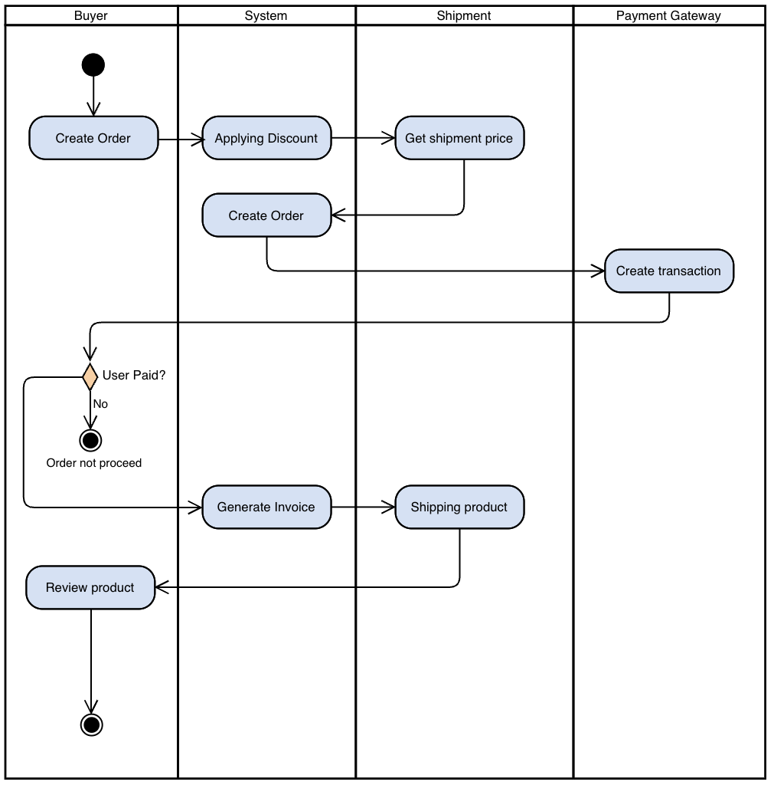

# Project Development - Dagangan

## 1. Product Requirement

### 1.1 Abstract

Dagangan is e-commerce application which sell products integrated in payment gateway and expedition we make online shopping as easy as browsing your phone fast catalog discovery, painless checkout, real-time shipping info, and social proof (ratings & reviews).

**Objectives**

* Enable buyers to discover, compare and purchase products in under 3 taps
* Give sellers a self-service portal to manage catalog, orders, inventory
* Seamlessly integrate payments (Midtrans) and shipping (RajaOngkir)
* Provide end-to-end order tracking + review system

### 1.2 Key Persona

| Persona          | Goals                                                                                   |
| ---------------- | --------------------------------------------------------------------------------------- |
| **Buyer**  | Find & buy products quickly, track shipments, leave feedback, View Historical Purchases |
| **Seller** | Upload/manage products, view incoming orders, track payouts                             |

### 1.3 User Stories

#### Buyer

1. **Registration & Login**

   * As a new user, I want to sign up with email/password or Google so I can place orders.
   * As a returning user, I want to log in so I can access my cart and orders.
2. **Product Discovery**

   * As a buyer, I want to browse by category, search by keyword, filter by price/rating so I find relevant items.
3. **Cart & Checkout**

   * As a buyer, I want to add/remove items from my cart, save addresses, choose a payment method, and complete checkout in one flow.
4. **Order Tracking & Reviews**

   * As a buyer, I want to view order status (paid → shipped → delivered) and leave ratings + photos after delivery.
5. **Coupons & Voucher**

   * As a buyer, I want to enter a voucher code at checkout so I can get a discount on my order.
   * As a buyer, I want to see product-level “sale” prices on listing pages.

#### Seller

1. **Seller Onboarding**
   * As a seller, I want to create a store profile, upload KYC docs, and set up my payout method.
2. **Catalog Management**
   * As a seller, I want to create/update/delete products, manage stock, set prices and shipping weights.
3. **Order Fulfillment**
   * As a seller, I want to view new orders, print packing slips, and mark shipments with tracking numbers.

### 1.4 Base Application

| Criteria         | Value                                                                                                                       |
| ---------------- | --------------------------------------------------------------------------------------------------------------------------- |
| Application Name | Dagangan                                                                                                                    |
| Platform         | Website/PWA                                                                                                                 |
| Tech Stack       | - Vite + ReactJS - NodeJS + Express - PostgresSQL + Sequelize - TypeScript - Swagger API Docs           |
| 3rd Party API    | - Midtrans - Raja Ongkir - Login using Google                                                                     |
| Required Feature | - Mobile Responsive - Light and Dark mode theme - Indonesia and English language - AI Product recommendation |

### 1.5 Functional Requirements

| Feature Area                     | Requirements                                                                                                                                                                                                                             |
| -------------------------------- | ---------------------------------------------------------------------------------------------------------------------------------------------------------------------------------------------------------------------------------------- |
| **Authentication**         | - Email/password + google login - JWT-based sessions - "Forgot password" flow - "Linked Account" flow                                                                                                                    |
| **User Profile & Address** | - Edit profile (name, phone) - Address book (billing & shipping) - Default address selection                                                                                                                                   |
| **Product Catalog**        | - CRUD for products (name, SKU, price, stock, weight, images, description) - Category hierarchy + many-to-many tagging                                                                                                              |
| **Search & Filter**        | - Full-text search - Faceted filtering (price range, rating, seller, category) - Sort by popularity/newness                                                                                                                    |
| **Cart / Wishlist**        | - Add/edit/remove items in cart (persisted per user) - Save item-level price snapshot - Wishlist to bookmark products                                                                                                          |
| Coupons & Discounts              | - Create/assign Product-level discounts (type: percent/fixed, start/end dates) - Voucher codes at checkout: validate code, enforce min order, usage count, expiry, combinality - Display applied discount & final totals in UI |
| **Checkout & Payment**     | - Calculate subtotal, shipping fee (via RajaOngkir API), tax, discounts - Midtrans integration for card, e-wallet, bank transfer - Capture payment callbacks                                                                   |
| **Order Management**       | - Create Order + OrderItems - Assign order_number - Order status workflow (new → paid → shipped → delivered → closed)                                                                                                      |
| **Shipping & Tracking**    | - Fetch rates & ETAs from RajaOngkir - Enter courier + tracking number - Real-time status updates                                                                                                                              |
| **Reviews & Ratings**      | - 1–5 star rating + text comment - Upload multiple images/videos (max 5 per review) - Review moderation queue                                                                                                                |
| **Seller Portal**          | - Dashboard: orders, revenue, payouts - Inventory adjustments & low-stock alerts                                                                                                                                                    |
| **Notifications**          | - In-app & email for: order status changes, payment failures, low stock, promotional events                                                                                                                                              |

#### 1.6 Non-Functional Requirements

| Category                | Requirements                                                                          |
| ----------------------- | ------------------------------------------------------------------------------------- |
| **Performance**   | - P95 page-load < 2 s on mobile - API < 200 ms response under normal load        |
| **Scalability**   | - Stateless services behind load-balancer - Dockerized for horizontal scaling    |
| **Security**      | - TLS everywhere - OWASP Top-10 compliance - Rate-limit sensitive endpoints |
| **Availability**  | - 99.9% uptime SLA - Automated health-checks & self-healing restarts             |
| **PWA & Offline** | - Service-worker caching for catalog browsing - "Add to Home Screen" support    |
| **Accessibility** | - WCAG 2.1 AA compliance - Proper ARIA attributes                                |
| **Localization**  | - Bahasa Indonesia - English UI strings                                          |
| **Observability** | - Centralized logging (ELK) - Metrics + alerting (Prometheus / Grafana)          |

## 2. Use Case Diagram

- Use Case Description

## Larger Software Element

- Architecture Diagram

## ERD

## Navigation Map
